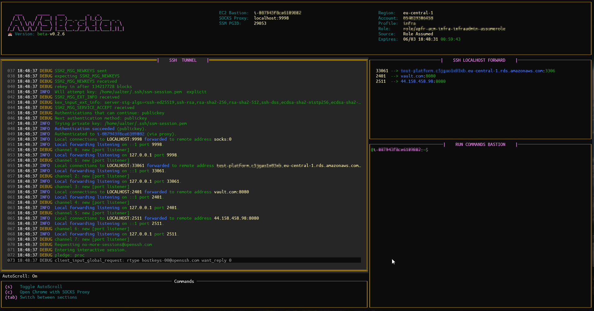

## **AWS-Bastion**
---
A utility tool to help management the interaction with a *EC2 Bastion (Managed Instance) through AWS SSM. It starts a SSH tunnel over a AWS SSM Session, making available a SOCKS Proxy for connections with private addresses in your AWS Account. It also allows run shell commands remotely at this connected EC2 Bastion.



In order to manage the start of your AWS Session, to connect with your EC2 Bastion, it checks if need to assume a role, if it needs an MFA Token, Source Profile, Region, etc. For this, the AWS-Bastion base the decisions, of how to open the AWS Session, on your configured AWS Shared Credentials and Config ```(~/.aws/credentials and ~/.aws/config)```. It is important to have them well configured to let the AWS-Bastion works properly. 


  - [**Requirements**](#requirements)
  - [**Installation**](#installation)
  - [**AWS Session loading sequence precedence**](#aws-session-loading-sequence-precedence)

--- 

### **Requirements**
Must be installed in the system:
- **AWSCLI**: https://docs.aws.amazon.com/cli/latest/userguide/getting-started-install.html
- **AWS Session Manager Plugin**: https://docs.aws.amazon.com/systems-manager/latest/userguide/session-manager-working-with-install-plugin.html
```bash
# To test AWS Session-Manager-Plugin
$ session-manager-plugin
The Session Manager plugin was installed successfully. Use the AWS CLI to start a session.
```
- **ssh** 

---

### **Installation**

:cd: Download:
- https://github.com/ualter/aws-bastion-site/releases
  - [aws-bastion-v0.2.7-linuxAmd64.tar.gz](https://github.com/ualter/aws-bastion-site/releases/download/v0.2.7/aws-bastion-v0.2.7-linuxAmd64.tar.gz)
  - [aws-bastion-v0.2.7-windowsAmd64.tar.gz](https://github.com/ualter/aws-bastion-site/releases/download/v0.2.7/aws-bastion-v0.2.7-windowsAmd64.tar.gz)
  - [aws-bastion-v0.2.7-darwinAmd64.tar.gz](https://github.com/ualter/aws-bastion-site/releases/download/v0.2.7/aws-bastion-v0.2.7-darwinAmd64.tar.gz)

---

### **AWS Session loading sequence precedence**
1. Use the explict AWS Profile parameter informed: 
   - `-p developer`
2. Use the AWS Profile configured at the configuration file:
   - Configuration file: `~/.aws-bastion/aws-bastion.yaml`
   - AWS Profile parameter:
     ```yml
     aws-session:
       profile: developer
     ```
    - ***Hint***: in case a value is configured in the file, and if still you don't want to use this or ANY other profile (empty), use the parameter: `p- none` without have to change the configuration file, then the next step will be chosen.
  
3. Use AWS Session available in Environment Variable O.S.
   
4. USe the AWS default profile

---

**This Bastion is an EC2 Managed Instance (has the SSM Agent installed), it is located in a Private Subnet, does not have a Public IP and neither any inbound open ports configured.*